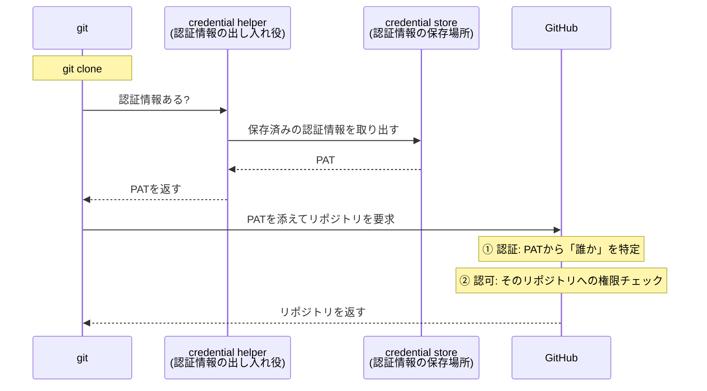
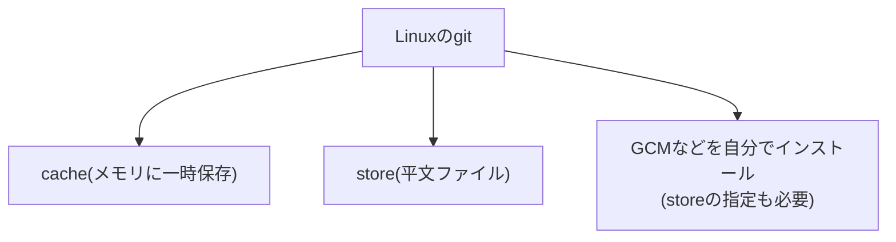
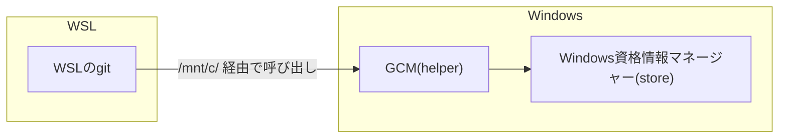

## 初めに

- GitHubの認証にハマって数時間格闘したので、内容を整理してみました。

## 前提

### gitに認証はない
- そもそもgitは認証なしで使えます。
- 認証が発生するのはリモートリポジトリを操作するときだけなので、混同しないように注意。
- gitを導入し、適当なディレクトリで`git init`をしてから`git add`、`git commit`などを実行するとイメージが湧くかも。
<details><summary>実行結果</summary>

```console
hoge@DESKTOP-0S27K7O:/Work$ mkdir /tmp/git-auth-demo
hoge@DESKTOP-0S27K7O:/Work$ cd /tmp/git-auth-demo/
hoge@DESKTOP-0S27K7O:/tmp/git-auth-demo$ git init
hint: Using 'master' as the name for the initial branch. This default branch name
hint: will change to "main" in Git 3.0. To configure the initial branch name
hint: to use in all of your new repositories, which will suppress this warning,
hint: call:
hint:
hint:   git config --global init.defaultBranch <name>
hint:
hint: Names commonly chosen instead of 'master' are 'main', 'trunk' and
hint: 'development'. The just-created branch can be renamed via this command:
hint:
hint:   git branch -m <name>
hint:
hint: Disable this message with "git config set advice.defaultBranchName false"
Initialized empty Git repository in /tmp/git-auth-demo/.git/
hoge@DESKTOP-0S27K7O:/tmp/git-auth-demo$ ll -a
total 0
drwxr-xr-x  3 hoge hoge  60 Jul  4 19:29 .
drwxrwxrwt 14 root  root  440 Jul  4 19:29 ..
drwxr-xr-x  6 hoge hoge 180 Jul  4 19:29 .git
hoge@DESKTOP-0S27K7O:/tmp/git-auth-demo$ echo "hello" > hello.txt
hoge@DESKTOP-0S27K7O:/tmp/git-auth-demo$ git add hello.txt
hoge@DESKTOP-0S27K7O:/tmp/git-auth-demo$ git commit -m "first commit"
[master (root-commit) 4ae5fa4] first commit
 1 file changed, 1 insertion(+)
 create mode 100644 hello.txt
hoge@DESKTOP-0S27K7O:/tmp/git-auth-demo$ git log --oneline
4ae5fa4 (HEAD -> master) first commit
```

</details>

### user.name / user.email も認証とは無関係
- `git config`で設定する`user.name`、`user.email`は**コミットに記録されるただのラベル**で、認証には一切使われません。
- 「gitに認証はない」ことを考えると自然ですが、ややこしいので注意。

## GitHubの認証はプロトコルで分かれる
1. HTTPS
2. SSH

- SSHは鍵認証でなんとな～くイメージがつくので、この記事ではHTTPSプロトコルを使った認証について記載します。

### HTTPSの認証で使うPATとは
- PAT(Personal Access Token)は、HTTPSの認証で**パスワードの代わりに使うランダムな文字列**です(`ghp_xxxx...` のような見た目)。
- GitHubは2021年にパスワードでのgit操作を廃止したため、HTTPSではPATが必須です。
- 使い方としては、gitが出す `Password:` プロンプトにPATを入力します。
  - ちなみにgitはPATの中身を知りません。入力されたものをそのままGitHubに送り、「パスワードは廃止、PATのみ受付」と検証するのはGitHub側。ここでも「聞く係はgit、検証する係はGitHub」と役割が分かれています。

## HTTPSの認証の仕組み

- 「GitHubの認証」には4人の登場人物が出てきます。
- `git clone` したときの流れを図にするとこうなります。



- 図にあるように、認証情報の実体は`credential store`に保存され、`credential helper`が出し入れします。
- push時に何度も認証情報を入力しなくていいのは、storeに保存された認証情報をhelperが毎回取り出してくれるおかげです。

## helperとstoreの組み合わせはOSで違う

- helperとstoreの組み合わせはOSで異なります。
- 主なものを整理するとこうなります。

| OS | helper | store | 特徴 |
| --- | --- | --- | --- |
| 全OS | cache | メモリ | git同梱。helperとstoreが一体型。デフォルト15分で消える一時保存 |
| 全OS | store | `~/.git-credentials`(平文ファイル) | git同梱。helperとstoreが一体型。シンプルだが平文保存でセキュリティ的に微妙 |
| macOS | osxkeychain | macOSキーチェーン | git同梱。OSのstoreに暗号化して保存 |
| Windows | wincred | Windows資格情報マネージャー | git同梱。osxkeychainのWindows版。PATは自分で発行して手打ち |
| Windows | GCM | Windows資格情報マネージャー | **現在のGit for Windowsのデフォルト**。認証情報がなければOAuthフローでトークンを自動取得(ブラウザに承認画面が開く)。|

:::note warn
helper名の `store` と保存場所という意味のstoreが紛らわしいですが、helperの `store` は「平文ファイルに直接保存するシンプルなhelper」です。
:::

### ではLinuxはどうなっているの？
- WindowsやmacOSでは標準でhelperとstoreが提供されていますが、Linuxにはありません。
- そのためhelperに`cache`、`store`を使わない場合は、自分でインストールする必要があります。



- それぞれの選択肢は以下の通りです。
  - helperの選択肢

| helper | 入手方法 | 特徴 |
| --- | --- | --- |
| cache | git同梱 | store一体型(メモリ)。設定だけで使えるが一時保存のみ |
| store | git同梱 | store一体型(平文ファイル)。設定だけで使えるがセキュリティ的に微妙 |
| libsecret | ディストリのパッケージ | GNOME Keyringをstoreに使う。デスクトップLinux向け |
| git-credential-oauth | ディストリのパッケージ | OAuthでトークンを自動取得する**取得専門のhelper**。storeを持たないので保存用のhelperと併用する |
| GCM | 手動インストール(.deb / tarball) | OAuth自動取得+保存もできるが、storeを自分で指定する必要がある |
| gh(GitHub CLI) | ディストリのパッケージ等 | GitHub専用。OAuth自動取得+gh自身がstoreも持つ一体型(詳細は後述) |

  - storeの選択肢

| store | 暗号化 | 永続性 | 対応するhelper |
| --- | --- | --- | --- |
| メモリ | -(プロセス内のみ) | 一時(デフォルト15分) | cache |
| `~/.git-credentials`(平文ファイル) | なし | 永続 | store |
| GNOME Keyring(Secret Service) | あり | 永続 | libsecret、GCM。**GUIセッションが必要**でサーバー用途では動かないことが多い |
| pass(GPG暗号化ファイル) | あり | 永続 | GCM |

- 試していませんが、以下が参考になりそうです。
  - https://zenn.dev/shimarisu_121/articles/11633ef05d5dcd  
  - https://github.com/git-ecosystem/git-credential-manager

#### ちなみにWSLの場合は別の選択肢もある
- WSLもLinuxなので上記の事情がそのまま当てはまります…が、純粋なLinuxと違って隣にWindowsがいるので、Windows側のGCMを間借りするという選択肢があります。
- 以下の設定で、WSL側のgitがWindows側のGCM(exe)をhelperとして呼び出せるようになります。

```bash
git config --global credential.helper \
  "/mnt/c/Program\ Files/Git/mingw64/bin/git-credential-manager.exe"
```

- この構成のうれしいところ
  - WSL側に何もインストールしなくていい
  - OAuthフローの承認画面もWindows側のブラウザで普通に開く
  - Windows側のgitと認証情報を共有できる(片方でログインすればもう片方も使える)



### GitHub専用でよければgh CLIという手もある
- gh(GitHub CLI)はPR作成などをターミナルから行うGitHub公式ツールですが、credential helperとしても使えます。

```bash
gh auth login      # OAuthフローでトークンを取得(またはPAT入力)
gh auth setup-git  # ghをgitのcredential helperとして登録
```

- 2つ目のコマンドを実行すると、gitの設定にはこう書き込まれます。

```console
$ git config --global --get-all credential.helper
!gh auth git-credential
```

- ghのイメージはhelperとstoreの一体型です。
- 以降、gitがGitHubと通信するときはghが保管しているトークンが使われます。
- 全OSで同じように動くため、Linuxのstore問題も回避できます。

:::note info
ブラウザがない環境(サーバー等)でも使えます。`gh auth login` で表示されるワンタイムコードを**別のマシンのブラウザ**で https://github.com/login/device に入力すれば認証できます(デバイスフロー)。
:::

:::note warn
GitHub専用なので、GitLabなど他のGitホスティングサービスには使えなさそう
:::

## 参考
- https://git-scm.com/book/ja/v2/Git-%e3%81%ae%e3%81%95%e3%81%be%e3%81%96%e3%81%be%e3%81%aa%e3%83%84%e3%83%bc%e3%83%ab-%e8%aa%8d%e8%a8%bc%e6%83%85%e5%a0%b1%e3%81%ae%e4%bf%9d%e5%ad%98
- https://github.blog/security/application-security/git-credential-manager-authentication-for-everyone/
- https://qiita.com/skkzsh/items/11dd107a0734fec682b8
- https://zenn.dev/shimarisu_121/articles/11633ef05d5dcd
- https://github.com/git-ecosystem/git-credential-manager
- https://git-scm.com/docs/gitcredentials
- https://git-scm.com/doc/credential-helpers
- https://docs.github.com/ja/github-cli/github-cli/about-github-cli

## おわりに
- GitHubの認証について整理しました。
- helperについては記載しているもの以外にサードパーティ製が使えたりと色々ありそうですが、この辺で終わります。。。
